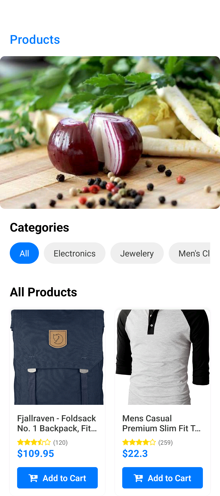
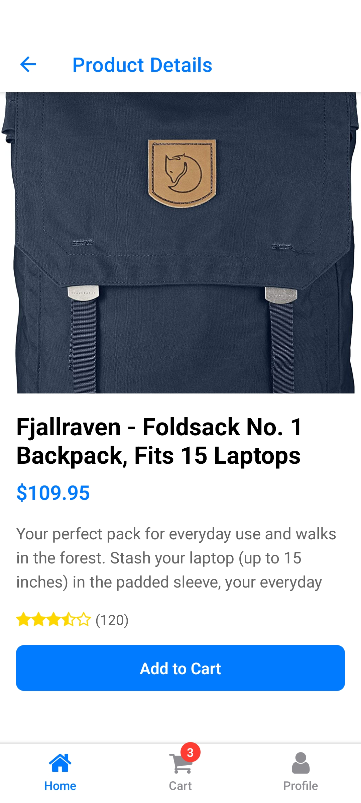
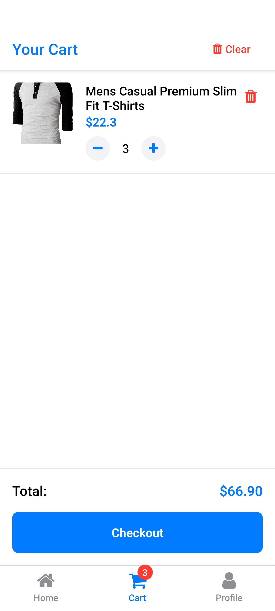
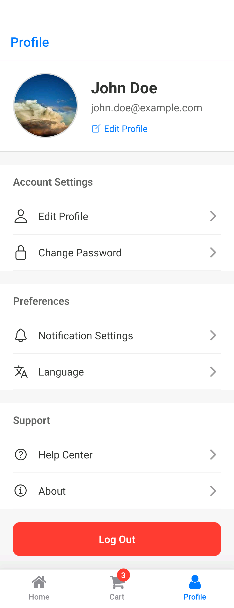

# E-Commerce Mobile App

A modern e-commerce mobile application built with React Native, Redux Toolkit, and TypeScript.

## Features

- 🛍️ **Product Browsing**
  - Grid view of products
  - Category filtering
  - Product details view
  - Star ratings display

- 🛒 **Shopping Cart**
  - Add/remove products
  - Quantity management
  - Persistent cart storage
  - Total price calculation

- 🏷️ **Categories**
  - Horizontal scrolling category list
  - Quick category filtering
  - "All" category option
  - Visual category selection feedback

- 🖼️ **UI/UX**
  - Modern and clean design
  - Responsive layout
  - Loading states
  - Error handling
  - Smooth animations

## Screenshots

| Home Screen | Product Details |
|------------|----------------|
|  |  |
| Shopping Cart | User Profile |
|  |  |

## Tech Stack

- React Native
- TypeScript
- Redux Toolkit
- React Navigation
- AsyncStorage
- Expo Vector Icons

## Getting Started

### Prerequisites

- Node.js (v14 or higher)
- npm or yarn
- Expo CLI (`npm install -g expo-cli`)
- iOS Simulator (for Mac users) or Android Emulator
- For physical device testing: Expo Go app installed on your device

### Installation

1. Clone the repository:
   ```bash
   git clone https://github.com/Molingejr/ecommence-app.git
   cd ecommence-app
   ```

2. Install dependencies:
   ```bash
   npm install
   # or
   yarn install
   ```

3. Start the development server:
   ```bash
   npm start
   # or
   yarn start
   ```

4. Run on your preferred platform:
   - Press `i` for iOS simulator
   - Press `a` for Android emulator
   - Scan QR code with Expo Go app on your physical device

### Development

- **Reload App**: Press `r` in the terminal
- **Toggle Menu**: Press `m` in the terminal
- **Debug**: Press `j` in the terminal
- **Clear Cache**: Press `c` in the terminal

## Project Structure

```
ecommence-app/
├── app/                    # Main application code
│   ├── components/        # Reusable UI components
│   │   ├── CategoryList.tsx
│   │   ├── ImageCarousel.tsx
│   │   ├── ProductCard.tsx
│   │   ├── ProductGrid.tsx
│   │   └── StarRating.tsx
│   ├── screens/           # App screens
│   │   ├── home.tsx
│   │   └── product-details.tsx
│   ├── _layout.tsx        # Root layout configuration
│   └── index.tsx          # Entry point
├── store/                 # State management
│   ├── api.ts            # API configuration and endpoints
│   ├── cartSlice.ts      # Shopping cart state management
│   ├── categorySlice.ts  # Category filtering state
│   ├── index.ts          # Redux store configuration
│   ├── storage.ts        # AsyncStorage utilities
│   └── types.ts          # TypeScript interfaces
├── assets/               # Static assets
├── .expo/               # Expo configuration
├── app.json            # Expo app configuration
├── expo-env.d.ts       # Expo TypeScript declarations
├── package.json        # Project dependencies
├── tsconfig.json       # TypeScript configuration
└── eslint.config.js    # ESLint configuration
```

## State Management

The app uses Redux Toolkit for state management with the following slices:

- **Cart Slice**: Manages shopping cart state
  - Add/remove items
  - Update quantities
  - Calculate totals
  - Persist cart data

- **Category Slice**: Manages product filtering
  - Category selection
  - Filter state
  - Clear filters

## Contributing

1. Fork the repository
2. Create your feature branch (`git checkout -b feature/amazing-feature`)
3. Commit your changes (`git commit -m 'Add some amazing feature'`)
4. Push to the branch (`git push origin feature/amazing-feature`)
5. Open a Pull Request

## License

This project is licensed under the MIT License - see the [LICENSE](LICENSE) file for details.